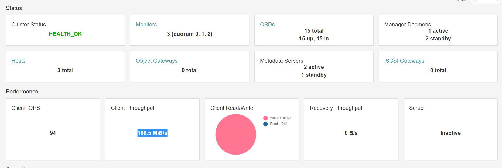
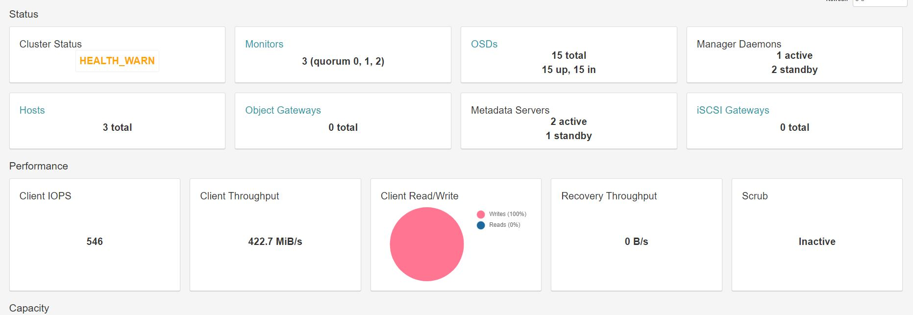

### Ceph Nautilus集群部署和调试

| 作者 | 时间 |QQ技术交流群 |
| ------ | ------ |------ |
| perrynzhou@gmail.com |2020/12/01 |672152841 |

#### Ceph安装前准备

```

echo "172.16.84.37 node1" >> /etc/hosts
echo "172.16.84.41 node2" >> /etc/hosts
echo "172.16.84.42 node3" >> /etc/hosts
echo "172.16.84.37 deploy" >> /etc/hosts


useradd cephfsd
echo "ceph123"|passwd cephfsd --stdin
echo "cephfsd ALL = (root,ceph) NOPASSWD:ALL" | sudo tee /etc/sudoers.d/cephfsd
chmod 0440 /etc/sudoers.d/cephfsd
setenforce 0
sed -i 's/enforcing/disabled/g' /etc/selinux/config
systemctl stop firewalld.service
systemctl disable firewalld.service

[root@172.25.78.14 ~]su - cephfsd
[cephfsd@node1 ~]ssh-keygen
[cephfsd@node1 ~]ssh-copy-id node1
[cephfsd@node1 ~]ssh-copy-id node2
[cephfsd@node1 ~]ssh-copy-id node3
```
#### 更新ceph 源

```
wget -O /etc/yum.repos.d/CentOS-Base.repo http://mirrors.aliyun.com/repo/Centos-7.repo
yum clean all && yum makecache && yum update -y
yum install epel-release -y
yum install -y https://mirrors.aliyun.com/ceph/rpm-nautilus/el7/noarch/ceph-deploy-2.0.1-0.noarch.rpm
```

#### 安装ceph

```
[cephfsd@node1 ~]su - cephfsd
[cephfsd@node1 ~]mkdir ceph-cluster
[cephfsd@node1 ~]cd ceph-cluster
[cephfsd@node1 ~]ceph-deploy purge node1 node2 node3

// 清除配置
[cephfsd@node1 ~] ceph-deploy purgedata node1 node2 node3
[cephfsd@node1 ~] ceph-deploy forgetkeys
[cephfsd@node1 ceph-cluster]$ ceph-deploy purge  node1 node2 node3 
[cephfsd@node1 ceph-cluster]$ ceph-deploy new  --cluster-network 172.16.84.0/24 --public-network 172.16.84.0/24 node1 node2 node3

[cephfsd@node1 ceph-cluster]$ ceph-deploy install --release "nautilus"  node1 node2 node3 
[cephfsd@node1 ceph-cluster]$ ceph-deploy --overwrite-conf config push node1 node2 node3
[cephfsd@node1 ceph-cluster]$ ceph-deploy mon create-initial


[cephfsd@node1 ceph-cluster]$ ceph-deploy mgr create node1 node2 node3

[cephfsd@node1 ceph-cluster]$ ceph-deploy mds create node1 node2 node3
//启用dashboard
[cephfsd@node1 ceph-cluster]$ ceph-deploy admin  node1 node2 node3
//安装debug调试信息
[cephfsd@node1 ceph-cluster]$ yum install -y ceph-debuginfo.x86_64 -y
//安装ceph dashboard
[cephfsd@node1 ceph-cluster]$ yum install -y ceph-mgr-dashboard
[cephfsd@node1 ceph-cluster]$ ceph mgr module enable dashboard --force 
[cephfsd@node1 ceph-cluster]$ ceph mgr module ls 
[cephfsd@node1 ceph-cluster]$ ceph dashboard create-self-signed-cert 
[cephfsd@node1 ceph-cluster]$ ceph config set mgr mgr/dashboard/ssl false
//其中的admin和admin分别是dashboard的用户和密码
// echo "admin">pass
[cephfsd@node1 ceph-cluster]$ ceph dashboard ac-user-create -i pass admin  administrator
// 浏览器输入 https://node1:8443
```
#### ceph集群验证

```
[cephfsd@node1 ceph-cluster]$ sudo ceph -s
  cluster:
    id:     bd5d7c6b-d450-4028-904f-76c8fc3505dd
    health: HEALTH_WARN
    		// 这里出现这个问题需要安装 typeing库，这个依赖python3.更改yum为2.7,连接pyton到python3.6的二进制，执行curl https://bootstrap.pypa.io/get-pip.py -o get-pip.py && python get-pip.py
        // yum install python2-typing
            Module 'volumes' has failed dependency: No module named typing
            OSD count 0 < osd_pool_default_size 3
 
  services:
    mon: 3 daemons, quorum node1,node2,node3 (age 48s)
    mgr: node1(active, since 33s), standbys: node2, node3
    osd: 0 osds: 0 up, 0 in
 
  data:
    pools:   0 pools, 0 pgs
    objects: 0 objects, 0 B
    usage:   0 B used, 0 B / 0 B avail
    pgs:     
```

#### ceph添加osd

```


// sdf是一个ssd磁盘，上面创建一个分区，用于存储rocksdb的wal和db部分
[cephfsd@node1 ceph-cluster]$ vgcreate cache /dev/sdf1

[cephfsd@node1 ceph-cluster]$ lvcreate --size 100G --name db-0 cache
[cephfsd@node1 ceph-cluster]$ lvcreate --size 40G --name  wal-0 cache

[cephfsd@node1 ceph-cluster]$ lvcreate --size 100G --name db-1 cache
[cephfsd@node1 ceph-cluster]$ lvcreate --size 40G --name  wal-1 cache
// hdd的osd
[cephfsd@node1 ceph-cluster]$ ceph-deploy osd create  --bluestore node1 --data  /dev/sda    --block-db cache/db-0 --block-wal cache/wal-0 

// ssd的osd
[cephfsd@node1 ceph-cluster]$ ceph-deploy osd create --bluestore node1 --data  /dev/sdf2    --block-db cache/db-1 --block-wal cache/wal-1 
```

#### ceph安装mds

```
ceph-deploy mds create  node1 node2 node3
```

#### ceph自定义crush

```
 ceph osd getcrushmap -o ./crushmap.bin
 crushtool -d crushmap.bin -o ./crushmap.txt
 vim ./crushmap.txt
 // 把ssd的磁盘单独放到一个池子中
 root fs-meta-disk {
    id -10       # do not change unnecessarily
    # weight 6.000
    alg straw
    hash 0  # rjenkins1
    item osd.7 weight 3.493
    item osd.6 weight 3.493
    item osd.8 weight 3.493
}
// 指定规则使用ssd中的osd
 rule fs-meta-disk {
    id 1
    type replicated
    min_size 1
    max_size 10
    step take fs-meta-disk
    step chooseleaf firstn 0 type osd
    step emit
}

 crushtool -c crushmap.txt -o crushmap-new.bin
 ceph osd setcrushmap -i crushmap-new.bin
```

#### 创建mds的数据Pool和meta Pool

```
[cephfsd@node1 ceph-cluster]$ sudo ceph osd pool create cephfs_data 128 128
[cephfsd@node1 ceph-cluster]$ sudo ceph osd pool create cephfs_metadata 128 128
[cephfsd@node1 ceph-cluster]$ sudo ceph osd pool set cephfs_metadata crush_rule fs-meta-disk
[root@node1 ~]# ceph osd tree
ID  CLASS WEIGHT   TYPE NAME         STATUS REWEIGHT PRI-AFF 
-10       10.47899 root fs-meta-disk                         
  6   ssd  3.49300     osd.6             up  1.00000 1.00000 
  7   ssd  3.49300     osd.7             up  1.00000 1.00000 
  8   ssd  3.49300     osd.8             up  1.00000 1.00000 
 -1       54.14397 root default                              
 -3       18.04799     host node1                            
  0   hdd  7.27699         osd.0         up  1.00000 1.00000 
  3   hdd  7.27699         osd.3         up  1.00000 1.00000 
 -5       18.04799     host node2                            
  1   hdd  7.27699         osd.1         up  1.00000 1.00000 
  4   hdd  7.27699         osd.4         up  1.00000 1.00000 
 -7       18.04799     host node3                            
  2   hdd  7.27699         osd.2         up  1.00000 1.00000 
  5   hdd  7.27699         osd.5         up  1.00000 1.00000 
  
[cephfsd@node1 ceph-cluster]$ sudo ceph fs new cephfs cephfs_metadata cephfs_data
[cephfsd@node1 ceph-cluster]$ sudo ceph fs set cephfs max_mds 1
```

#### 客户端挂载cephfs

- ceph-fuse
```
// 拷贝集群节点中的/etc/ceph/ceph.conf到客户端节点的/etc/ceph目录下
[cephfsd@node1 ceph-cluster]$ scp -r /etc/ceph/ceph.conf  ceph@172.16.84.54:~/
// 拷贝集群节点中的ceph.client.admin.keyring.conf 到客户端节点
[cephfsd@node1 ceph-cluster]$ scp -r ceph.client.admin.keyring.conf  ceph@172.16.84.54:~/
ceph-fuse -m 172.16.84.37:6789 /mnt/cephfs/
```
- kernel fuse

```
// ceph.client.admin.keyring  ceph.conf 需要从ceph-deploy部署目录生成的的文件拷贝客户端172.16.84.54:/etc/ceph目录
root@172.16.84.54 /etc/ceph $ ls
ceph.client.admin.keyring  ceph.conf
root@172.16.84.54 /etc/ceph $ cat ceph.client.admin.keyring 
[client.admin]
        key = AQAVqlJgcLrYFRAAuHFPSqhIg1/gvFFwYKulzA==
        caps mds = "allow *"
        caps mgr = "allow *"
        caps mon = "allow *"
        caps osd = "allow *"
        
// name=admin,secret=AQAVqlJgcLrYFRAAuHFPSqhIg1/gvFFwYKulzA== 分别对应client.admin中的admin;key对应的是secret
root@172.16.84.54 /etc/ceph $ mount -t ceph 172.16.84.37:6789:/ /mnt/cephfs -o name=admin,secret=AQAVqlJgcLrYFRAAuHFPSqhIg1/gvFFwYKulzA==
```
#### 安装netdata监控主机

```
bash <(curl -Ss https://my-netdata.io/kickstart-static64.sh)
在浏览器中输入:https://host:19999
```


#### 使用Ceph RBD功能

- 创建rbd

```
[root@node1 ~]#  ceph osd pool create ai-rbd 128 128
pool 'ai-rbd' created
[root@node1 ~]# ceph osd pool set ai-rbd crush_rule rbd-disk
set pool 4 crush_rule to rbd-disk

[root@node1 ~]# rbd pool init ai-rbd
```

- 查看 rbd
```
[root@node1 ~]# ceph osd lspools
1 cephfs_data
2 cephfs_metadata
3 ai-rbd
```
- 创建rbd image
```
[root@node1 ~]#  rbd create rbd_data1 --pool ai-rbd --size 3096G --image-feature layering 
[root@node1 ~]# rbd ls -l --pool ai-rbd
NAME      SIZE    PARENT FMT PROT LOCK 
rbd_data1 500 GiB          2           
[root@node1 ~]# rbd --pool ai-rbd --image rbd_data1 info
rbd image 'rbd_data1':
        size 500 GiB in 128000 objects
        order 22 (4 MiB objects)
        snapshot_count: 0
        id: 1419898976eb
        block_name_prefix: rbd_data.1419898976eb
        format: 2
        features: layering
        op_features: 
        flags: 
        create_timestamp: Tue Mar 23 15:46:06 2021
        access_timestamp: Tue Mar 23 15:46:06 2021
        modify_timestamp: Tue Mar 23 15:46:06 2021
```

- 客户端使用
```
// 服务节点的的ceph配置
[admin@node1 ceph]$ ls
ceph.client.admin.keyring  ceph.conf  rbdmap  tmphKNPRx
// 172.16.84.54客户端节点，把ceph中配置拷贝到客户端节点下面的/etc/ceph中
[admin@node1 ceph]$ scp -r ceph.client.admin.keyring  ceph.conf  admin@172.16.84.54:~/ceph


// 在客户单节点执行
root@172.16.84.54 /home/admin/ceph $ rbd --pool ai-rbd --image rbd_data1 info

// 如果/dev/rbd0存在，就umap掉
root@172.16.84.54 ~ $ rbd unmap /dev/rbd0

// rbd map {pool-name}/{image-name}
root@172.16.84.54 ~ $  rbd map ai-rbd/rbd_data1
/dev/rbd0

//客户端节点挂载

root@172.16.84.54 ~ $ mount /dev/rbd0 /data/rbd  
```

#### Ceph RBD性能

- 并发16个客户端写，每个客户端写入，RDB的pool使用的3个OSD，每个OSD对应磁盘类型是HDD

  

#### Cephfs 性能

- 并发16个客户端写数据到cephfs,cephfs 的metadata存放在ssd上，data存储在hdd上.	  
  