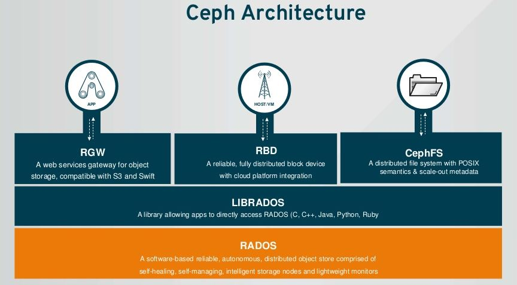
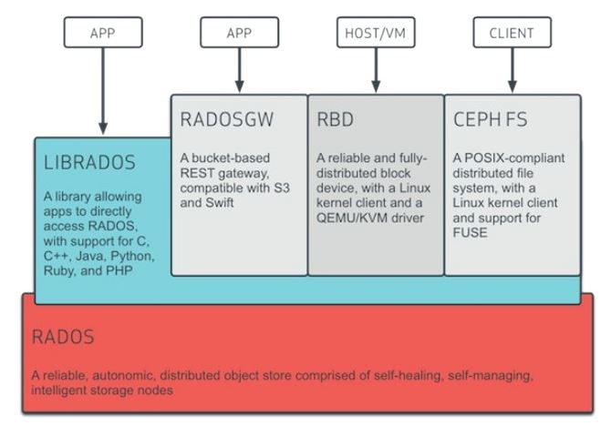
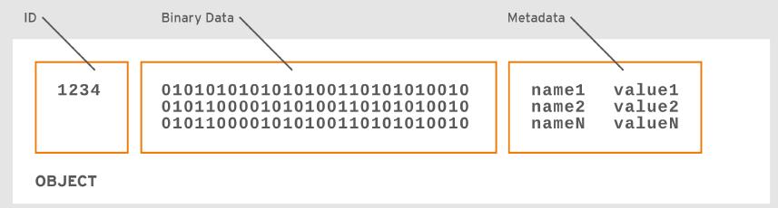
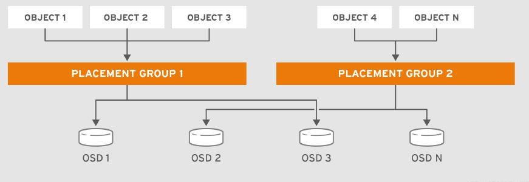
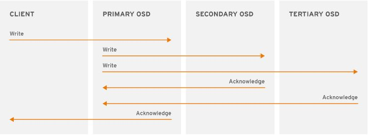
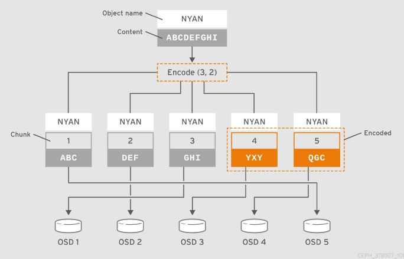
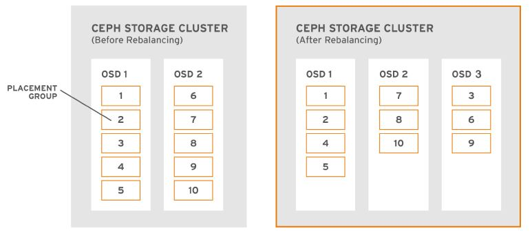

## Ceph架构概览


| 作者 | 时间 |QQ技术交流群 |
| ------ | ------ |------ |
| perrynzhou@gmail.com |2020/12/01 |672152841 |

#### Ceph架构是什么样的?

- 总体概览



- 架构模块



- ceph包括了底层最核心的rados,这个包含了monitor、mds、osd.
- rados之上有一层librados,提供底层服务的接口
- librados之上有三个服务，分别是cephfs、rbd、rgw
#### Ceph提供了哪几种类型的服务？

- 基于多语言的API接口
- RESTFul 接口，类似于(S3/Swift)
- 块设备接口
- 文件系统接口

#### 部署一个ceph都包含了哪些组件？各自都是干什么的？
- 部署一个Ceph集群，目前有如下进程组成
  - Ceph OSD Daemon,这是ceph用户处理客户端数据的进程，提供EC数据编码、数据均衡、数据恢复、监控等功能。目前每一个磁盘或者lvm对应一个osd进程，用于处理请求过来的数据
  - Ceph Monitor, Monitor进程维护了整个集群的各种map信息，包括osd map、mds map、pg map、 mon map等信息。整个集群采用了Paxos共识算法来保证整个集群维护数据的一致性。
  - Ceph Manager,Manager进程维护了PG的详细信息。处理来自客户端的只读的cli请求，比如pg的统计信息同时ceph也提供RESTful的监控API

#### 客户端是如何读取数据的？
- ceph客户端维护object id列表和object存储的pool信息。但是不维护object->osd的映射关系。为了读取数据，客户端需要访问monitor进程获取当前整个集群的cluster map信息。客户端提供object名称和pool名称给librados,librados计算object 所在的pg，根据crush算法在找到主的osd.客户端直接和主osd通信进行读写操作。

- osd存储数据是采用扁平的方式，每个对象有一个唯一的ID，同时包括了数据和元数据。



#### Ceph Pool有哪些？



- Pool Type,Ceph提供了2中Pool的类型，一种是三副本；另外一种是EC。Pool一旦创建就不能进行更改，数据也是基于Pool类型来进行存储
- Placement Groups,Ceph的Pool存储上亿个对象对象，执行各种各样的复杂操作，比如通过多副本或者EC进行数据持久化、数据的CRC检查、数据复制、负载均衡、恢复等。基于每个数据对象的管理的扩展性和性能会是一个瓶颈。Ceph是通过在pool中放置placement groups来解决这个问题。首先crush算法计算数据对象的placement group和placement group对应的一组osd，两层映射关系，然后通过crush算法把每个placement group存储在一组osd中。
- CRUSH Ruleset,CRUSH扮演这另外一个很重要的角色。crush可以检测osd的冗错域和性能。crush可以识别osd的存储介质和水平组织node、racks、rows等不同的域.crush算法可以把数据对象存储在不同的域，防止osd失效。比如一个数据存储在不同的nodes、racks，如果集群中有一些osd宕机，集群依然可以操作直到整个集群恢复。
- Durability,在大规模存储集群中，硬件故障是非常平常的事情。ceph提供了2种存储策略
  - Replica Pool,使用crush算法把数据对象放到跨冗错域的osd上。也就是数据对象放到不同的node或者racks下的node的磁盘上。
  - Erasure Code Pool,每个数据对象被划分为K+M的分片，K是分片是数据对象分片数，M是数据对象校验分片。

#### Ceph Placement Groups 是什么？

- Ceph采用Placement Group来存储数据对象，同时PG也是一个Pool的子集。Ceph把很多PG在分散Pool中，然后通过获取到集群的map信息和状态通过crush算法把pg伪随机分布到集群的osd中

#### Ceph Placement Groups怎么工作的？
- 当用户创建pool过程中,crush来创建这个pool中的pg数量。通常来讲PGs的数量应该是一个合理数值。例如每个osd中有100个PG，这就意味着每个pg包含了整个pool的1%的数据。
- PGs的数量会影响性能，这涉及到pg在osd之间的移动。如果出现了osd的故障或者异常情况，一个pool有少量的pg,ceph会迁移大量pg，到一个可用的osd中，同时pg中包含了大量的数据对象，这涉及的迁移数据量太多对于集群性能影响调大。如果一个pool中包含了非常多的pg,虽然迁移的数据量小了，但是会消耗更多的CPU和内存。一般会采用如下公式进行计算PG的数量

```
              (OSDs * 100)
   Total PGs =  ------------
                 pool size
```

#### Crush算法和PG在集群扩容或者osd失效情况下是什么样的行为？

- 集群扩容，当添加新机器或者新osd到集群，cluster map改变了。添加新的osd意味着crush算法伪随机把原来osd中的pg迁移到新的osd中，这个是自动的过程。
- osd宕机,当osd宕机，集群的状态改变了，采用副本或者EC。如果是主的osd宕机，从的osd立马充当主的osd,原来宕机的osd中的pg中的数据，通过crush算法迁移到其他的osd中
- 一旦ceph集群中cluster map或者cluster state改变，crush会自动计算哪一个osd改变了。比如客户端写入数据testdata到pool A,crush算法把testdata放到PG 1中，然后存储在osd5中。osd5和osd10、osd15互为副本。如果osd5宕机了，集群状态改变了，ceph客户端从pool A读取数据testdata,通过librados自动从osd10(osd5宕机，osd10成为了主osd)读取


#### Crush Ruleset是什么？
- crush ruleset 是整个osd的容灾top图，crush ruleset是给pool使用的，当客户端从pool获取数据，ceph会识别cursh ruleset.使用crush ruleset的规则，选择top-level的bucket来获取数据。当ceph进程处理crush rule,会识别出主osd，ceph客户端会直接和主osd进行连接，读写主osd中的pg中的数据对象

#### Ceph的读写操作是什么样的流程？



- ceph 客户端从ceph monitor获取cluster map,然后执行在pool中的pg执行IO操作。cursh ruleset和pg的数量是决定数据对象放在哪里的核心因素。获取到最新的cluster map，ceph客户端是不知道数据对象在哪里。

- 只有写操作需要客户端的object id和pool名称，ceph把数据存储在pool中。当客户端写入数据对象时候，会输入object的哈希、pg的数量、pool名称作为写入参数，然后使用crush计算对应哪个pg id和主的osd.客户端会经过如下几个步骤计算PG ID:

  ```
  1.客户端使用pool id和object id作为参数，然后根据object id进行哈希计算
  2.crush拿到object id和哈希值，哈希值针对当前pool中所有的pg数量总数取余，获得pg id
  3.crush通过crush规则计算出pg id对应的主osd
  4.客户端在PG ID前加上pool ID，例如4.58,然后客户端这对数据对象的读写删操作直接和主的osd进行操作
  ```
  
- ceph集群的topology和state是相对稳定的。让一个Ceph客户端通过librados来计算对象位置比要求客户端查询存储集群要快得多对于每个读/写操作。cursh算法允许客户端计算object存储在哪个位置，同时允许ceph客户端直接和主osd进行读写数据。如果集群的状态改变，ceph客户端可以直接从ceph minotor请求并且更新集群状态信息。

##### Ceph的多副本介绍
- 和ceph客户端一样，ceph的osd可以从ceph monitor获取最新的cluster map信息。ceph的osd可以使用crush算法，osd使用crush算法数据对象存储需要的pg id和主osd。当客户端写数据对象到主的osd,主的osd发现需要些副本，这个是副本的值是通过osd_pool_default_size来定义，然后主的osd拿到object id、pool名称、集群的map,然后使用cursh算法来计算从的osd的位置，然后主osd通过集群网络写数据对象到从的osd，完成后主的osd通知客户端写入成功。
- ceph在实际使用中一般会设置3副本pool,这样ceph的机制允许客户端在一个osd宕机后继续可以读写。但是如果是2副本，宕机一个osd,为了保证数据的一致性ceph集群对外会停止写服务。在ec pool中，ceph提供8+3、8+4、4+2的这三种EC的编码方式

##### Ceph的纠删码介绍

​	

- Ceph可以加载很多EC的算法，早期是使用Reed-Solomon算法。纠删码实际会把数据分为K个数据块和M个校验块。数据对象划分为N块，N=K+M.K个块是原始数据块，M是冗余的块。纠删码模式下允许M个块损坏，数据依然可以访问。比如10个数据块，6个校验块，一共16个块分布式16个osd中，原始10个数据块可以从6个osd中进行恢复。即使6个osd宕机，ceph集群也不会都是数据。

- 和副本池类似，ec pool中的主osd负责负责数据所有的写操作。在replica pool中，每个数据对象都有副本。对于ec pool处理是有一些不同的。ec pool存储每个数据对象，数据对象被华为k+m个块，k个数据块,m个校验块。k+m个块分散pool的osd中。同时ceph也会存储每个数据分片的rank作为数据对象的属性。主的osd负责纠删编码k+m个块，然后发送给其他的osd。


##### Ceph的ObjectStore是什么？

- ObjectStore提供了low-level的接口给osd的裸设备使用。当客户端read/write数据，直接和ObjectStore接口交互。ceph写操作具有ACID的事务的。ObjectStore写入一个事务要么成功要么失败，这是体现了原子性。数据对象存在ceph集群有一个唯一的编号、数据、元数据，因此ObjectStore根据这些信息来保证数据对象的一致性。ObjectStore通过顺序写操作来保证隔离性。osd提供副本或者EC pool的接口，这体现了持久性。ceph实现了如下方式存储引擎存储数据

  ```
  1.FileStore:企业生产级别的使用文件系统存储数据对象
  2.BlueStore:企业生产级别使用裸设备存储对象数据
  3.MemeStore:开发级别用于在内存测试读写操作
  4.K/V Store:ceph内部实现的key/value数据库
  ```

  

##### BlueStore介绍

- 针对ssd或者非易失内存、NVME，采用FileStore实现对象存储有太多的限制。因此ceph自研了BlueStore来消除这些限制，直接接管裸设备来数据对象。BlueStore使用了非常轻量级的BlueFS来适配k/v database.同时BlueStore也消除了FileStore的写放大问题。
- BlueStore存储了哪些数据呢？
  - object data：ceph存储裸设备上的block信息，以object作为block.
  - Block Database：block database中处理对象语义保证一致性。一个对象有唯一的ID，ID作为key存储block database中，value是有一系列的block地址(这些地址存储了数据对象、数据对象所在的pg、数据对象的元数据)。
  - Write-ahead Log:wal 日志保证了原子性，这个和FileStore的journaling日志相似。BlueStore记录了事务信息。

##### Ceph集群自身管理涉及哪些操作？

-  osds的健康检查，然后上报自身的健康状态给monitor
- 通过cursh算法把数据对象映射到pg,同时也会把pg映射到一组osd中
- osd自身也会使用crush算法来做数据均衡和恢复其他宕机osd中数据

##### Ceph 心跳有哪些？

- 当osd加入到集群，osd会上报自身的状态给montior,一般osd会有up和down状态来反应osd是否是运行正常和客户端是否可以从这个osd请求数据。
- 如果osd宕机，monitor会定期ping这个osd是否正常；同时osd之间也会进行心跳探测，然后上报状态给monitor

##### Ceph的数据均衡和恢复如何工作的？

- 当添加新的osd到集群，cluster map会更新，cluster map更新也就以为需要改变数据对象的存储位置，这是cluster map更改，导致由于crush算法计算的输入变化了。当新添加osd时候，会从其他的osd迁移" 少量"的数据到新的osd中。比如集群中有50个osd,新添加一个osd,在新的osd中会有1/50的数据迁移到新的osd中。

  

##### Ceph如何保证数据完整性？

- Scrubbing,osd进程会在副本间的数据扫描操作，以检测副本间的数据一致性。Scrubbing通常是每天执行执行。osd也会深度比较副本间的数据对象(一个比特一个比特比较)，这种Deep Scrubbing是每周执行一次，这种能发现磁盘驱动器出现坏道
- CRC Checks,在Ceph L版本以后采用了BlueStore,它可以通过CRC算法来校验写操作，然后存储CRC的值在BlueStore中的block database中。读取的时候从block database获取CRC 的值，然后和当前读取到数据对象的CRC来进行比较，来保证数据的一致性